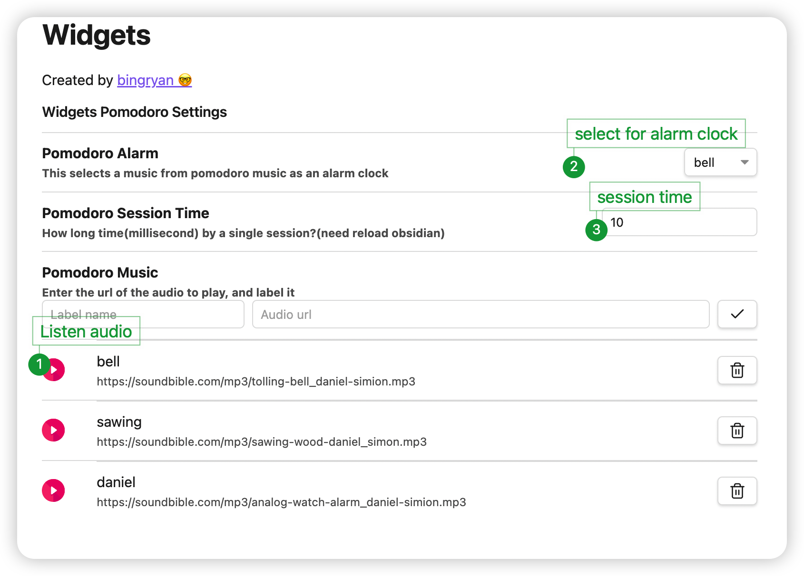

# Obsidian Widgets Plugin(WIP)

## Features
### Pomodoro Timer

- [x]  Session Time Message
- [x]  The alarm clock rings for time up
- [x]  Custom audio/music/alarm

https://user-images.githubusercontent.com/41174435/208292102-5931bdff-223c-47fa-b28b-379902452f24.mp4

## Widget List

## Settings

## How to Install

### From within Obsidian

you can activate this plugin within Obsidian by doing the following:

- Open Settings > Third-party plugin
- Make sure Safe mode is **off**
- Click Browse community plugins
- Search for "Obsidian Widgets"
- Click Install
- Once installed, close the community plugins window and activate the newly installed plugin
